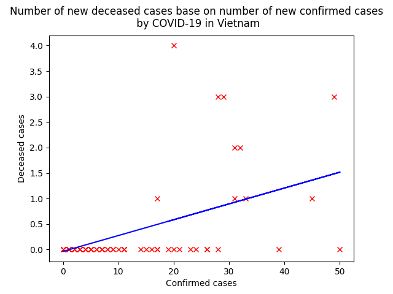
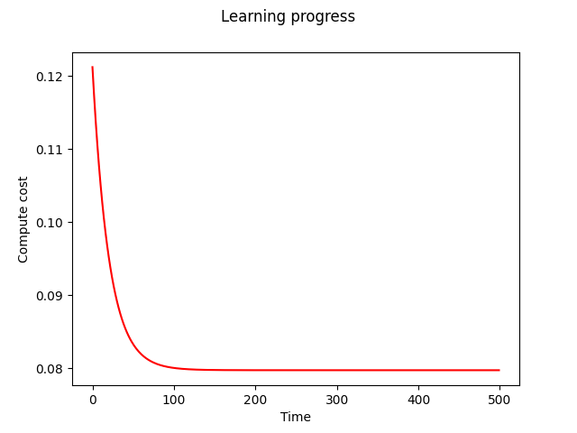

## Predict The Number Of Deceased Cases By COVID-19 Base On The Confirm Cases In Vietnam
This repository is an example of using linear regression in machine learning

### Code Requirements
This repository is in Python 3. The other requirements are NumPy and Mathplotlib

### Description
The program using datasets from [COVID-19 Open Data](https://console.cloud.google.com/marketplace/product/bigquery-public-datasets/covid19-open-data?filter=solution-type:dataset&q=covid-19%20open%20data&id=3d00830b-4317-47b0-b476-acfd2a46201a) to training this.
After training, comupter compute theta vector to predict.

### Execution
To run this example, simply run the `covid-predict.py` file using Python 3
```
python3 covid-predict.py
```
The output will look like this
```
LOADING DATA...COMPLETE
INITIALISE MACHINE...COMPLETE
LEARNING...COMPLETE
THETA = [-0.03533926  0.03105615]
COMPUTE COST = 0.08(ALPHA = 0.02, NUMBER OF ITERATE = 500)
DISPLAY PLOT:
	FIGURE 1: DISPLAY RESULT
	FIGURE 2: LEARNING PROGRESS
```
Plots:



Prediction plot



Learning progress plot